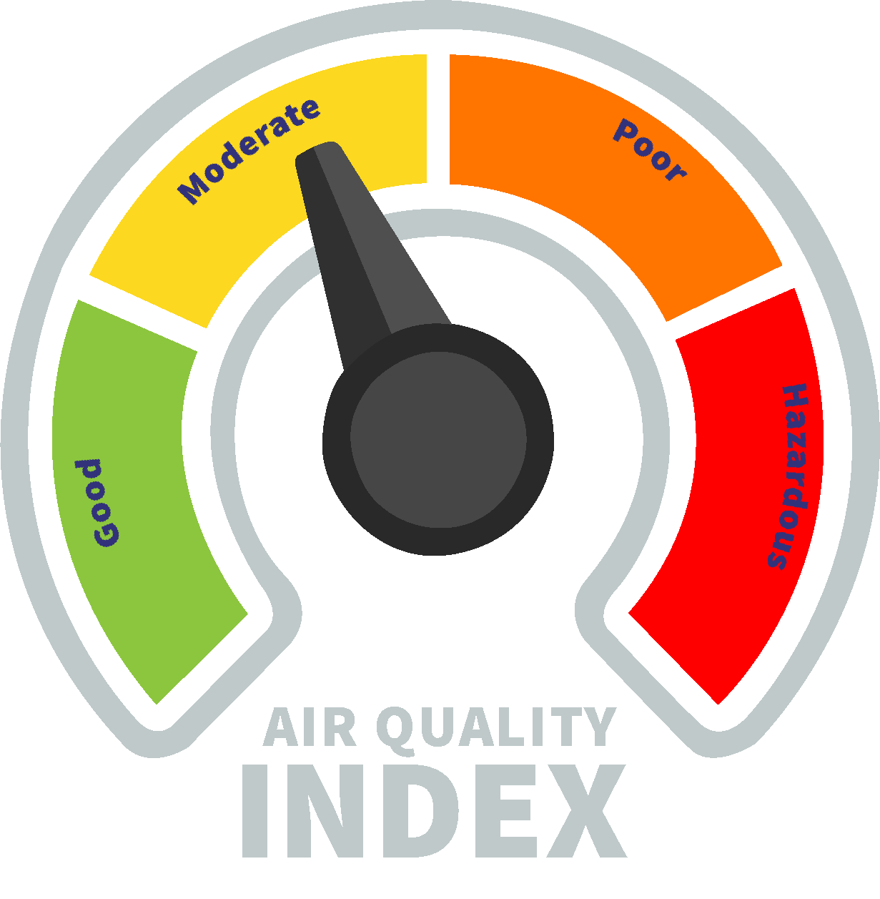

## 🌬️ AirQualityPrediction



I created this resource for the `Hackers Club`'s Machine Learning session at the `University of Peradeniya, Department of Computer Engineering`. It's designed to help beginners dive into the world of Machine Learning. The codes are meticulously prepared, well-organized, and thoroughly documented, ensuring a smooth learning experience for newcomers to ML.

### Instructions

1. `git clone https://github.com/EshanJayasundara/AirQualityPrediction.git`
2. `conda create -n air_quality python=3.12.4`
3. `cd AirQualityPrediction`
4. `pip install -r requirements.txt`
5. Run the `AirQualityPrediction_Multiclass_MLFlow.ipynb` and this will create `production/caches.pkl` file which contains the preprocessing data to apply it at the production. (**Note:** Don't change the running order of the cells. Run exactly from top to bottom. Otherwise, some issues in the `caches` list can happen and may lead to many errors. **If you need to run an intermediate cell again, restart the kernel and run the whole notebook again.**)
6. `export PYTHONPATH=$PYTHONPATH:$(pwd)` on Linux, `$env:PYTHONPATH = "$env:PYTHONPATH;$(Get-Location)"` on Windows Powershell or `set PYTHONPATH=%PYTHONPATH%;%CD%` on Windows cmd.
7. `mlflow server`
8. `cd production`
9. `fastapi dev main.py`

10. Open postmen and try

      - `GET` request to `http://127.0.0.1:8000` and will output,
        ```json
        {
          "message": "MLflow API is running"
        }
        ```
      - 'POST' request to `http://127.0.0.1:8000/predict` with `json` request body,
      
        ```json
        {
          "features": [
            [29.8, 59.1, 5.2, 17.9, 18.9, 9.2, 1.72, 6.3, 319],
            [28.3, 75.6, 2.3, 12.2, 30.8, 9.7, 1.64, 6.0, 611],
            [23.1, 74.7, 26.7, 33.8, 24.4, 12.6, 1.63, 5.2, 619],
            [27.1, 39.1, 6.1, 6.3, 13.5, 5.3, 1.15, 1.1, 551],
            [26.5, 70.7, 6.9, 16.0, 21.9, 5.6, 1.01, 2.7, 303],
            [39.4, 96.6, 14.6, 35.5, 42.9, 17.9, 1.82, 3.1, 674],
            [41.7, 82.5, 1.7, 15.8, 31.1, 12.7, 1.8, 4.6, 735],
            [31.0, 59.6, 5.0, 16.8, 24.2, 13.6, 1.38, 6.3, 443],
            [29.4, 93.8, 10.3, 22.7, 45.1, 11.8, 2.03, 5.4, 486],
            [33.2, 80.5, 11.1, 24.4, 32.0, 15.3, 1.69, 4.9, 535]
          ]
        }
        ```
      
        and will output,
      
        ```json
        {
          "predictions": [2, 2, 2, 2, 2, 0, 1, 2, 1, 1]
        }
        ```

11. Troubleshooting

    - Log saved at `mlflow_api`
    - To check if there exists a module and its version, run `python -c "import <module>; print(<module>.__version__)"` after the installation. Replace `<module>` with module name.</br>
      Ex: `python -c "import pydantic; print(pydantic.__version__)"`.

    - miniconda installation guide: https://docs.anaconda.com/miniconda/install

    - Access mlflow tracking server UI: http://127.0.0.1:5000/

### Dataset

- **The dataset is from kaggle:** https://www.kaggle.com/datasets/mujtabamatin/air-quality-and-pollution-assessment by @Mujtaba Mateen.

- **Features:**

  - `Temperature` (°C): Average temperature of the region.</br>
  - `Humidity` (%): Relative humidity recorded in the region.</br>
  - `PM2.5` Concentration (µg/m³): Fine particulate matter levels.</br>
  - `PM10` Concentration (µg/m³): Coarse particulate matter levels.</br>
  - `NO2` Concentration (ppb): Nitrogen dioxide levels.</br>
  - `SO2` Concentration (ppb): Sulfur dioxide levels.</br>
  - `CO` Concentration (ppm): Carbon monoxide levels.</br>
  - `Proximity to Industrial Areas` (km): Distance to the nearest industrial zone.</br>
  - `Population Density` (people/km²): Number of people per square kilometer in the region.

- **Target Variable: `Air Quality` Levels:**

  - `Good`: Clean air with low pollution levels.</br>
  - `Moderate`: Acceptable air quality but with some pollutants present.</br>
  - `Poor`: Noticeable pollution that may cause health issues for sensitive groups.</br>
  - `Hazardous`: Highly polluted air posing serious health risks to the population.</br>

### Step-by-Step Breakdown of the Notebook

#### 1. Importing Required Libraries

- Loads essential libraries like `pandas`, `numpy`, `sklearn`, and `seaborn`.
- Imports custom utility functions from `utils.utils`.

#### 2. Setting Global Variables

- Defines a **global random state (`66`)** for reproducibility.
- Initializes an empty **cache dictionary**.
- Creates a **mapping** to convert air quality categories (`Moderate`, `Good`, `Hazardous`, `Poor`) into numerical values.

#### 3. Logging Setup

- Initializes logging and saves logs to a file (`mlflow_api.log`).

#### 4. Loading the Dataset

- Reads an **air pollution dataset** from `./data/air_pollution_dataset.csv`.
- Identifies `"Air Quality"` as the **target variable**.
- Stores the **initial feature names** in a cache for reference.

#### 5. Data Preprocessing

This step **cleans and prepares the dataset** before training models.

##### 5.1 Handling Missing Values

- Calls `fill_nulls()` to process missing values in both **features (`X`) and target (`y`)**.
- Drops features where missing values exceed `90%` (default threshold).
- Fills **numerical missing values** with the **mean** and **categorical missing values** with the **mode**.
- If the target column has too many missing values (`> 50%`), it **raises an error**.
- Stores missing value handling details in the **cache**.

##### 5.2 Removing Outliers

- Calls `filter_outliers()` using the **Z-score method**.
- Excludes some columns (`PM2.5`, `PM10`) from outlier removal to **prevent excessive data loss**.
- Logs and raises an error if a feature has too many outliers.
- Stores the **outlier detection details in the cache**.

##### 5.3 Encoding Categorical Features

- Calls `encode_categorical_vars()` to **convert categorical features** into numerical values.
- Stores encoding details in the **cache**.

##### 5.4 Encoding the Target Variable

- Calls `encode_categorical_tar()` to **map categorical class labels** (`Moderate`, `Good`, etc.) to **numerical values**.
- Stores encoding details in the **cache**.

##### 5.5 Removing Highly Correlated Features

- Calls `remove_correlated_duplicates()` to **drop features** with **high correlation** (`> 0.9`).
- Keeps the feature that is **more strongly correlated** with the target variable.
- Stores correlation filtering details in the **cache**.

##### 5.6 Saving Preprocessing Cache for Production

✅ The notebook **stores all preprocessing steps in a cache** (`caches.pkl`) to be used later in a **production scenario**.  
✅ This allows for consistent **feature transformations on new data** before making predictions.

#### 6. Splitting Data into Train and Test Sets

- Uses `train_test_split()` to divide the dataset into:
  - **80% Training**
  - **20% Testing**

#### 7. Feature Scaling

- Initializes `StandardScaler` for **standardizing feature values**.
- Calls `scale_features()` to **apply scaling** to both **training and testing datasets**.
- Stores the **scaler object** in the **cache** for future reference.
- Validates that the **shapes of original and scaled feature sets match** to avoid errors.

#### 8. Model Selection

This step **compares multiple classification models** and selects the best one.

##### 8.1 Defining Classification Models

- Initializes **three classification models**:
  - `LogisticRegression`
  - `DecisionTreeClassifier`
  - `RandomForestClassifier`

##### 8.2 Evaluating Model Performance

- Calls `plot_model_performances()` to:
  - Train each model on the **scaled training data**.
  - Evaluate models using **Precision, Recall, F1-score, and Support**.
  - Display **performance metrics** for each class.

✅ The **best-performing model** is selected for **feature selection**.

#### 9. Feature Selection

This step **selects the most important features** to improve model efficiency.

##### 9.1 Selecting Features Using the Elbow Method

- Calls `select_features_elbow_method()`, which:
  - Trains the best-performing model.
  - Uses **feature importance scores** to sort features.
  - Identifies the **optimal number of features** using the **Elbow Method**.
  - Returns a list of the most **important features**.

##### 9.2 Selecting Features Using a Metric-Based Method

- Calls `select_features_metric_method()`, which:
  - Evaluates feature subsets based on a **performance metric** (`Accuracy`, `F1-score`, `Precision`, or `Recall`).
  - Trains the **best model** with increasing numbers of features.
  - Identifies the **optimal feature set** based on **max performance**.
  - Plots the **accuracy or F1-score trend** to visualize feature selection.
  - Returns the **best subset of features**.

#### 10. Production Scenario: Using Cached Preprocessing

✅ In a **production environment**, new incoming data can be processed using the **previously saved cache** (`caches.pkl`).

✅ The function `preprocess_production()` applies the **same feature transformations** (scaling, encoding, feature selection) to **ensure consistency** before making predictions.

#### 11. Final Output

At the end, the notebook provides:

- Preprocessed Feature Set (`X`)
- Preprocessed Target Variable (`y`)
- Best Performing Model
- Optimized Feature Set for Training
- Cached Preprocessing Artifacts for Production

#### Summary of the Full Workflow

1. Loads raw data
2. Handles missing values
3. Removes outliers using Z-score
4. Encodes categorical features and target
5. Removes highly correlated features
6. Saves preprocessing cache for production(`production/caches.pkl`)
7. Splits data into train and test sets
8. Applies feature scaling
9. Trains multiple classification models
10. Compares model performance
11. Selects the best-performing model
12. Selects the most important features using Elbow & Metric-based methods
13. Processes new data in production using the cached transformations
14. Outputs the cleaned dataset and best model

This notebook ensures that the **best model is trained on the most relevant features** while also making sure that the **same transformations are applied in production** for real-world predictions.
